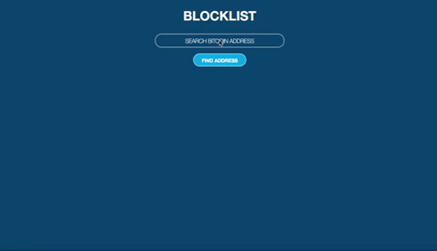
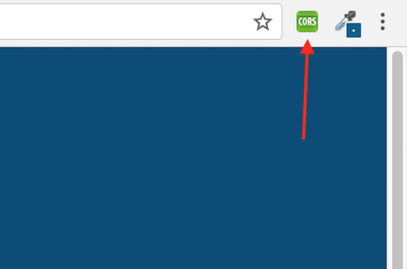

# BLOCKLIST

BLOCKLIST is an application that uses the blockchain.info API to find balance and transaction data on bitcoin addresses.

Simply enter a bitcoin address in the search field to see the data for that address.

Due Cross-Origin Resource Sharing (CORS), you must use Google Chrome and add the Allow-Control-Allow-Origin extension and turn it on. It's linked below.

### Technologies Used
- React and Javascript
- [Blockchain API](https://blockchain.info/api/blockchain_api)
- [Allow-Control-Allow-Origin Chrome extension](https://chrome.google.com/webstore/detail/allow-control-allow-origi/nlfbmbojpeacfghkpbjhddihlkkiljbi?utm_source=chrome-app-launcher-info-dialog)
